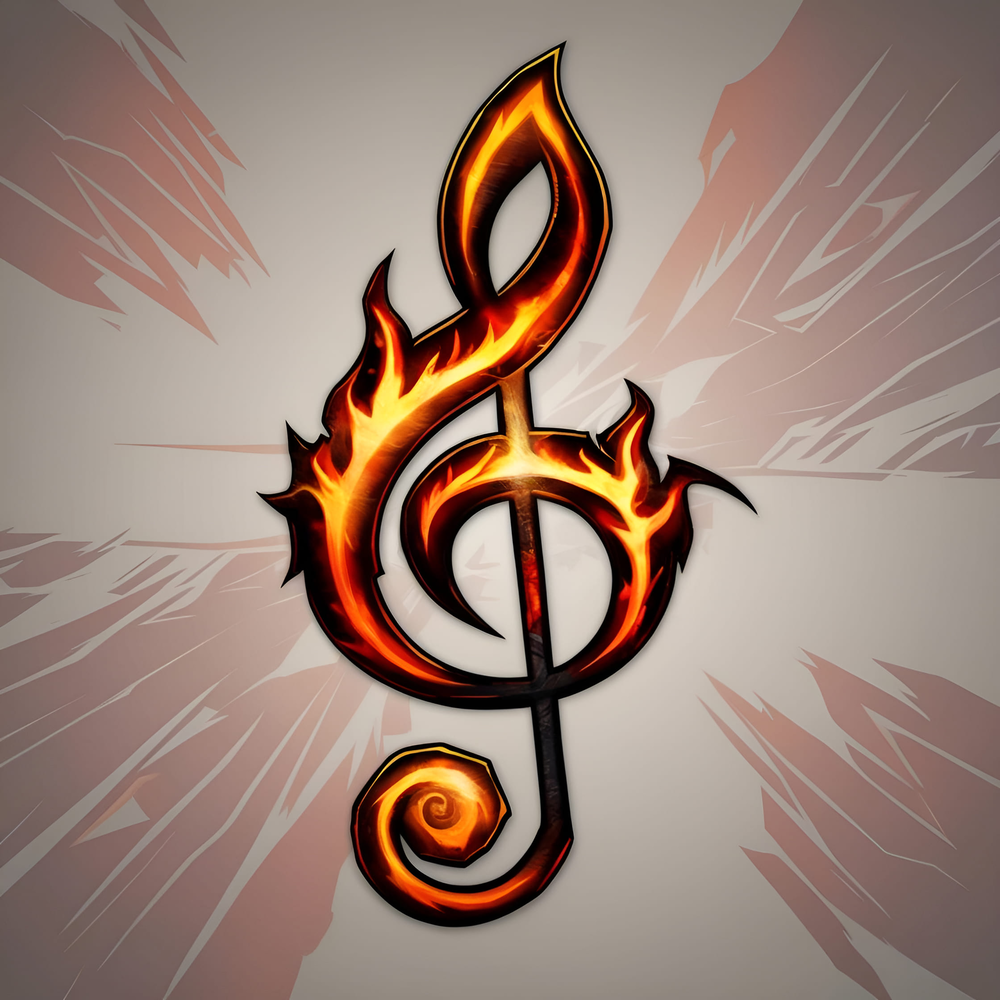

<!-- Improved compatibility of back to top link: See: https://github.com/othneildrew/Best-README-Template/pull/73 -->
<a name="readme-top"></a>

[![License][license-shield]][license-url]
[![Discord][discord-shield]][discord-url]

<!-- PROJECT LOGO -->
<br />
<div align="center">
  <a href="https://github.com/ZelionGG/DBM-EpicMusicPack">
    <kbd></kbd>
  </a>

  <h3 align="center">DBM-EpicMusicPack</h3>

  <p align="center">
    Enhance your boss fights with a selection of epic music for Deadly Boss Mods
    <br />
    <br />
    <a href="https://github.com/ZelionGG/DBM-EpicMusicPack/issues">Report Bug</a>
    ·
    <a href="https://github.com/ZelionGG/DBM-EpicMusicPack/issues">Request Feature</a>
  </p>
</div>

<!-- TABLE OF CONTENTS -->
<details>
  <summary>Table of Contents</summary>
  <ol>
    <li>
      <a href="#about-the-project">About The Project</a>
    </li>
    <li><a href="#installation">Installation</a></li>
    <li><a href="#usage">Usage</a></li>
    <li><a href="#adding-custom-music">Adding Custom Music</a></li>
    <li><a href="#license">License</a></li>
  </ol>
</details>

<!-- ABOUT THE PROJECT -->
## About The Project

DBM-EpicMusicPack provides a collection of epic music tracks specially selected to enhance your World of Warcraft boss encounters. Compatible with Deadly Boss Mods (DBM), this addon allows you to replace the default boss music with more immersive and epic alternatives.

<p align="right">(<a href="#readme-top">back to top</a>)</p>

<!-- INSTALLATION -->
## Installation

There are two methods to install this music pack:

1. **Via an addon client**:
   - Simply install this pack through your preferred addon client

2. **Manual installation**:
   - Download and extract the archive
   - Place the `DBM-EpicMusicPack` folder directly into your `addons` folder
   - Make sure you have DBM-Core version 7.2.7 or higher

<p align="right">(<a href="#readme-top">back to top</a>)</p>

<!-- USAGE -->
## Usage

Once installed, the music will be automatically available in DBM's music dropdown menus.

- Simply select the "EMP -" files from the music dropdown menus
- Enjoy an epic atmosphere during your boss fights!

<p align="right">(<a href="#readme-top">back to top</a>)</p>

<!-- ADDING CUSTOM MUSIC -->
## Adding Custom Music

You can easily add your own music tracks to the pack by following these steps:

1. **Add your music file**:
   - Convert your music to MP3 format
   - Place the file in the `DBM-EpicMusicPack\Music\` directory
   - Use a descriptive filename (e.g., `EMP_MyCustomTrack.mp3`)

2. **Register your music in MusicLoadList.lua**:
   - Open the `MusicLoadList.lua` file in a text editor
   - Add a new entry to the `musicTable` following this format:
   ```lua
   ["EMP_MyCustomTrack"] = "Artist Name - Track Title",
   ```
   - Make sure the filename (without the .mp3 extension) matches exactly what you used for your music file
   - Save the file

3. **Reload your UI**:
   - Type `/reload` in the WoW chat to reload your user interface
   - Your custom music will now appear in the DBM music dropdown menus with the prefix "EMP -"

Example:
```lua
-- Add this line to the musicTable in MusicLoadList.lua
["EMP_MyEpicBossFight"] = "My Name - Epic Boss Fight Theme",
```

<p align="right">(<a href="#readme-top">back to top</a>)</p>

<!-- LICENSE -->
## License

Distributed under the GNU General Public License v3.0 (GPL-3.0). See `LICENSE` for more information.

<p align="right">(<a href="#readme-top">back to top</a>)</p>

<!-- MARKDOWN LINKS & IMAGES -->
<!-- https://www.markdownguide.org/basic-syntax/#reference-style-links -->
[license-shield]: https://img.shields.io/github/license/ZelionGG/DBM-EpicMusicPack.svg?style=for-the-badge
[license-url]: https://github.com/ZelionGG/DBM-EpicMusicPack/blob/master/LICENSE
[discord-shield]: https://img.shields.io/badge/Discord-7289DA?style=for-the-badge&logo=discord&logoColor=white
[discord-url]: https://discord.gg/g7JZNGSU32
